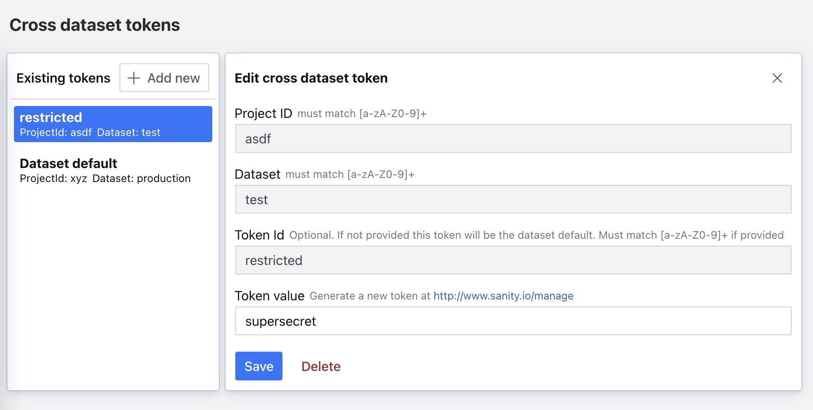

## Cross dataset tokens tool

This Sanity plugin supports a convenient way to maintain cross dataset tokens.


## Install

```
sanity install cross-dataset-tokens
```

## Enable only in dev

To enable this plugin only locally, configure the [Environments'](https://www.sanity.io/docs/sanity-json#933842c25dea) section in sanity.json   
```json
//...
"env": {
  "development": {
    "plugins": [
      "cross-dataset-tokens"
      //...
    ]
  }
}
```
